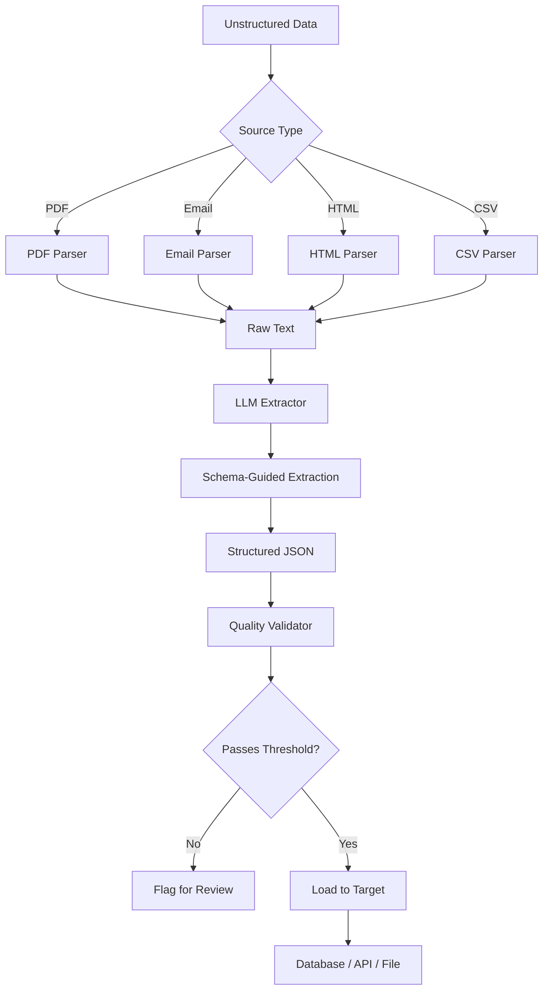

# AI GenAI Data Pipelines ETL

LLM-powered ETL pipelines for converting unstructured data (PDFs, emails, web pages) into structured formats with quality validation using LLM judges.

## Key Learning Objectives

- Understand how to design end-to-end ETL pipelines that leverage large language models for data extraction from unstructured sources
- Learn schema-guided prompting techniques to convert raw text (PDFs, emails, HTML) into validated structured JSON
- Implement LLM-as-judge patterns for automated data quality assessment including completeness and accuracy scoring
- Build multi-format document parsers that normalize diverse input sources into a unified processing pipeline
- Apply batch processing strategies with configurable concurrency to handle large-scale document ingestion efficiently
- Design validation gates and threshold-based routing to flag low-confidence extractions for human review
- Use Pydantic models to enforce strict output schemas and provide type-safe data contracts between pipeline stages
- Integrate async Python patterns with FastAPI to serve extraction pipelines as production-ready REST APIs
- Structure a Python project with Poetry, containerized deployment (Docker Compose), and comprehensive test coverage
- Practice prompt engineering for extraction tasks including few-shot examples, schema constraints, and error recovery

## Table of Contents
1. [Overview](#overview)
2. [Project Structure](#project-structure)
3. [Deployment](#deployment)
4. [Testing](#testing)

---

## End-to-End Flow



---

## Overview

| Component | Description |
|-----------|-------------|
| LLM Extractor | Schema-guided extraction from unstructured text |
| Quality Validator | LLM-as-judge for completeness and accuracy |
| Batch Processing | Process multiple documents in configurable batches |

---

## Project Structure

```
ai-genai-data-pipelines-etl/
├── src/data_pipelines/
│   ├── extractors/llm_extractor.py  # LLM-powered extraction
│   ├── quality/validator.py          # LLM quality judge
│   ├── config/settings.py
│   └── main.py
├── tests/
├── config/
├── pyproject.toml, Dockerfile, docker-compose.yml
```

---

## Deployment

```bash
poetry install && cp .env.example .env
poetry run python -m uvicorn data_pipelines.main:app --reload --port 8000
poetry run pytest
docker-compose up --build
```

---

## Testing

```bash
poetry run pytest --cov=src/data_pipelines --cov-report=term-missing
```
